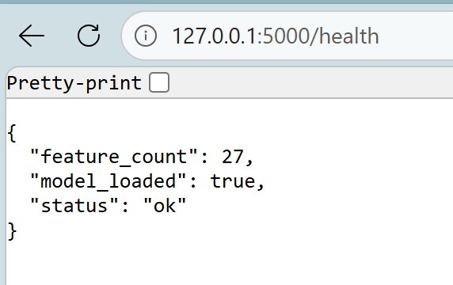
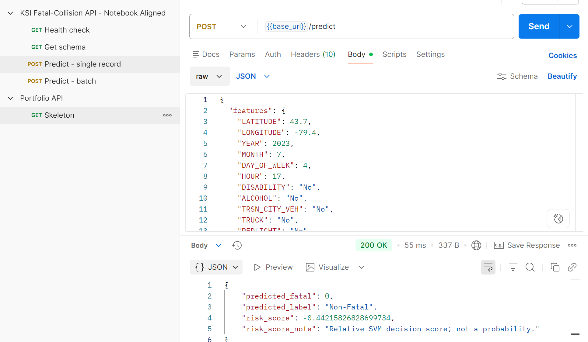
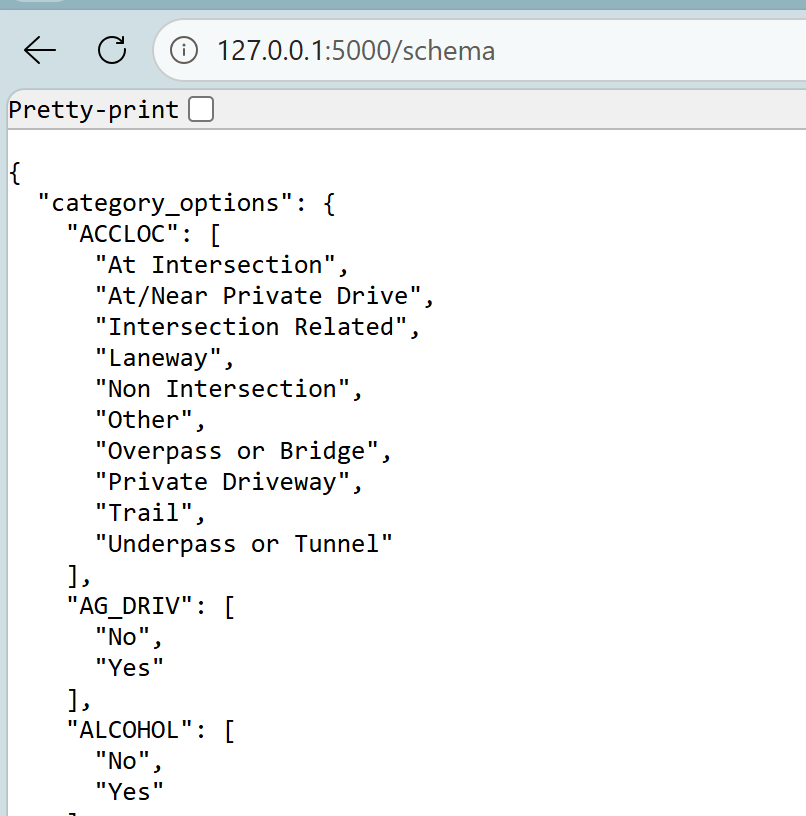

# Toronto KSI Fatal Collision Prediction

A machine learning prototype that uses historical Toronto KSI collision records to classify a recorded collision as Fatal or Non-Fatal Injury.

This academic project was completed collaboratively by a four-member team for COMP 247, Supervised Learning, at Centennial College.

## Working prototype

The repository includes the complete local prototype. It contains the source data used for the project, the executed analysis notebook, the training pipeline, the serialized model, a Flask API, a browser interface, Postman requests, and held-out API test data. The dependency versions match the environment recorded in the final project artifacts, including the saved model's scikit-learn version.

### API health check



### Prediction request and response



### Schema endpoint



The browser interface is implemented in `templates/index.html`, `static/style.css`, and `static/script.js`. It collects 27 collision features and sends them to `POST /predict`.

## Architecture

### Offline training


### Local prediction service


Training and inference remain separate. `train_model.py` builds and serializes the complete fitted pipeline. `app.py` loads the saved pipeline once when the service starts and uses it for individual or batch predictions.

## Data preparation

The raw dataset stored one row for each involved person or party. The prediction target described the collision outcome, so the project aggregated the records by `ACCNUM` and created one modelling row for each collision.

The source contained 4,928 rows without `ACCNUM`. With instructor approval, the project reconstructed identifiers by matching date, time, and street fields before collision-level aggregation.

Time fields were converted into year, month, weekday, and hour. The final model used 27 predictors covering location, time, road environment, contributing factors, and road-user involvement.

## Model development

Five supervised learning approaches were trained and tuned with stratified cross-validation:

- Logistic Regression
- Decision Tree
- Support Vector Machine
- Random Forest
- Neural Network

Fatal collisions represented approximately 13.9% of the collision-level records. The project therefore used Fatal F1 as the primary model-selection measure rather than overall accuracy.

SMOTE runs inside each training pipeline after preprocessing. This keeps synthetic oversampling within the training process and prevents the held-out test data from entering resampling.

## Final results

| Measure | Result |
| --- | ---: |
| Collision-level records | 6,863 |
| Training records | 5,490 |
| Held-out test records | 1,373 |
| Selected model | Linear SVM, C = 10 |
| Fatal recall | 61.26% |
| Fatal precision | 21.35% |
| Fatal F1 | 31.66% |
| ROC-AUC | 66.10% |

The selected SVM correctly identified 117 of 191 Fatal collisions in the test set. It also classified 431 Non-Fatal collisions as Fatal. The model provides a moderate analytical signal and produces many false alerts.

The returned `risk_score` is the SVM decision-function value. It describes distance from the classification boundary and does not represent a probability of death.

## My contributions

My primary contributions included:

- Initial exploratory data analysis
- Project framing and overall analytical direction
- Interpretation and communication of findings
- Development of the stakeholder presentation
- Review, integration, and refinement of the combined project

The notebook, modelling pipeline, deployment code, and final application evolved through collaborative team work. The final repository represents the combined team implementation.

## Repository contents

| Path | Purpose |
| --- | --- |
| `KSI_Final_Project.ipynb` | Executed EDA, preprocessing, model tuning, and evaluation |
| `train_model.py` | Rebuilds the collision dataset, trains the selected model, and saves deployment artifacts |
| `app.py` | Flask browser application and prediction API |
| `schema.py` | Shared list of input features and final SVM settings |
| `model.pkl` | Serialized fitted preprocessing, SMOTE, and SVM pipeline |
| `metadata.json` | Browser and API field metadata |
| `test_client.py` | Sends held-out records to the running API |
| `KSI_API.postman_collection.json` | Postman requests for health, schema, and prediction endpoints |
| `templates/` and `static/` | Browser interface |
| `docs/` | Implementation screenshots |

## Run locally

Use Python 3.11 or a compatible Python version.

```bash
python -m venv .venv
```

Activate the virtual environment, then install the pinned dependencies.

```bash
pip install -r requirements.txt
```

The repository already includes the fitted model and metadata used by the submitted prototype. Start the application with:

```bash
python app.py
```

Open `http://127.0.0.1:5000` in a browser.

To rebuild the fitted model and held-out test data from `KSI.csv`, run:

```bash
python train_model.py
```

To evaluate the running HTTP service with the saved held-out records, run this command in a second terminal:

```bash
python test_client.py
```

## Data source

The project uses the City of Toronto Open Data dataset [Motor Vehicle Collisions involving Killed or Seriously Injured Persons](https://open.toronto.ca/dataset/motor-vehicle-collisions-involving-killed-or-seriously-injured-persons/). The dataset page identifies the [Open Government Licence, Toronto](https://open.toronto.ca/open-data-licence/) as the applicable licence.

See [data/README.md](data/README.md) for the included project snapshot.

## Limitations

- The model classifies severity after a KSI collision record exists. It does not predict whether a collision will occur.
- The model identifies statistical associations and does not establish causation.
- Toronto historical patterns may not generalize to other cities or future conditions.
- The current test results show moderate separation and substantial false positives.
- The prototype runs locally and has not undergone production security, reliability, or operational validation.
- Any real road-safety use would require further validation, governance, and expert review.
